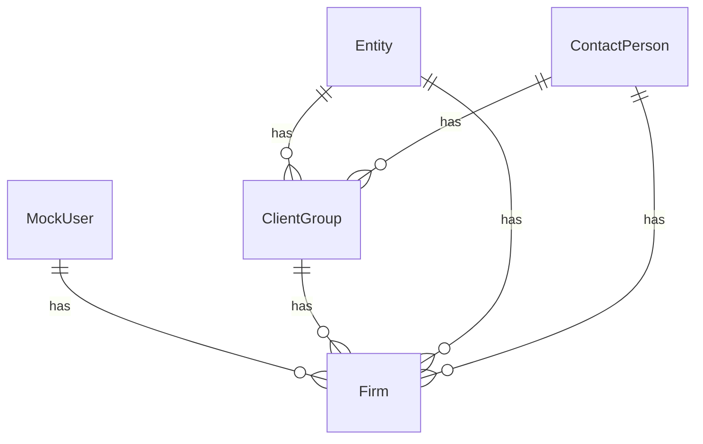

# Core Entities & Glossary

## Entity Relationship Diagram

## Entity Definitions

### MockUser
**Table**: `mockusers`

| Field | Type | Required |
|-------|------|----------|
| id | string | ✅ |
| firmId | string | ✅ |
| email | string | ✅ |
| password | string; // mock only — plain text for prototype | ✅ |
| name | string | ✅ |
| role | UserRole | ✅ |
| isActive | boolean | ✅ |
| avatarUrl | string | ❌ |

### AuthSession
**Table**: `authsessions`

| Field | Type | Required |
|-------|------|----------|
| user | MockUser | ✅ |
| token | string | ✅ |
| createdAt | number | ✅ |
| updatedAt | number | ❌ |

### Firm
**Table**: `firms`

| Field | Type | Required |
|-------|------|----------|
| id | string | ✅ |
| name | string | ✅ |
| email | string | ✅ |
| phone | string | ✅ |
| physicalAddress | string | ✅ |
| registrationNumber | string | ❌ |
| taxNumber | string | ❌ |
| vatNumber | string | ❌ |

### ClientGroup
**Table**: `clientgroups`

| Field | Type | Required |
|-------|------|----------|
| id | string | ✅ |
| firmId | string | ✅ |
| name | string | ✅ |
| groupNumber | string | ❌ |
| industry | string | ❌ |
| notes | string | ❌ |
| isArchived | boolean | ✅ |
| createdAt | string | ✅ |

### Entity
**Table**: `entitys`

| Field | Type | Required |
|-------|------|----------|
| id | string | ✅ |
| clientGroupId | string | ✅ |
| firmId | string | ✅ |
| name | string | ✅ |
| entityType | EntityType | ✅ |
| registrationNumber | string | ❌ |
| taxNumber | string | ❌ |
| vatNumber | string | ❌ |

### ContactPerson
**Table**: `contactpersons`

| Field | Type | Required |
|-------|------|----------|
| id | string | ✅ |
| clientGroupId | string | ✅ |
| firmId | string | ✅ |
| firstName | string | ✅ |
| lastName | string | ✅ |
| email | string | ✅ |
| phone | string | ❌ |
| position | string | ❌ |

### ClientGroupWithDetails
**Table**: `clientgroupwithdetails`

| Field | Type | Required |
|-------|------|----------|
| entities | Entity[] | ✅ |
| contacts | ContactPerson[] | ✅ |
| proposalCount | number | ✅ |
| createdAt | number | ✅ |
| updatedAt | number | ❌ |

### ServiceCategory
**Table**: `servicecategorys`

| Field | Type | Required |
|-------|------|----------|
| id | string | ✅ |
| firmId | string | ✅ |
| name | string | ✅ |
| icon | string | ✅ |
| colour | string | ✅ |
| sortOrder | number | ✅ |
| isActive | boolean | ✅ |
| createdAt | string | ✅ |

## Glossary

| Term | Definition |
|------|------------|
| At-Risk | Student performing below 50% |
| Intervention | Support action for struggling students |
| Coordinator | Staff managing tutoring programs |
| Performance Status | doing_well, needs_support, at_risk |
