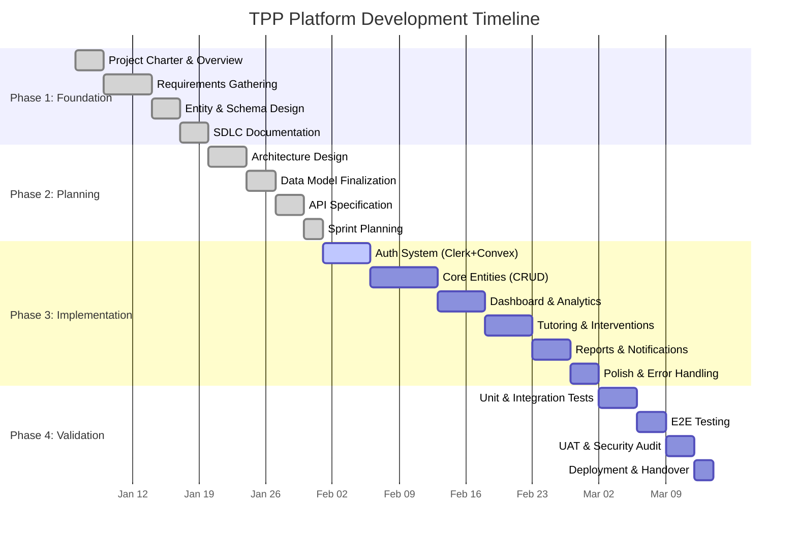

# Gantt Chart — TPP Platform

## Project Timeline (Mermaid.js)

## Milestones

| ID | Milestone | Target Date | Dependency |
|----|-----------|-------------|------------|
| M1 | Foundation Complete | Week 2 | — |
| M2 | Planning Complete | Week 4 | M1 |
| M3 | Core Build Complete | Week 8 | M2 |
| M4 | Testing Complete | Week 10 | M3 |
| M5 | Production Release | Week 12 | M4 |

## Critical Path
Foundation → Auth → Core Entities → Dashboard → Testing → Release
