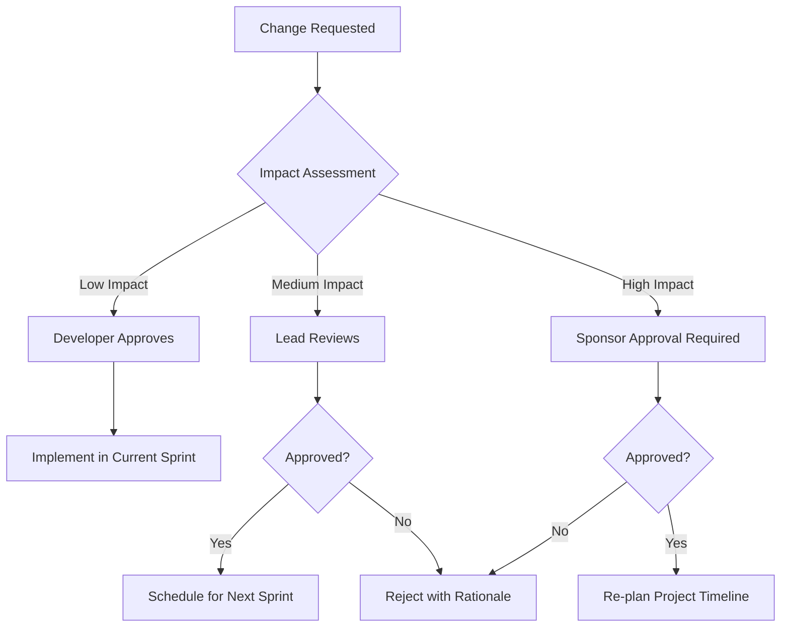

# Change Management Plan — TPP Platform

## Change Request Process

## Change Categories

| Category | Impact Level | Approval | Turnaround |
|----------|-------------|----------|------------|
| Bug Fix | Low | Developer | Same sprint |
| UI Tweak | Low | Developer | Same sprint |
| Feature Enhancement | Medium | Lead | Next sprint |
| New Feature | High | Sponsor | Re-plan |
| Architecture Change | Critical | Sponsor + Lead | Full review |
| Security Fix | Critical | Immediate | Hotfix |

## Change Request Template

| Field | Description |
|-------|-------------|
| **CR-ID** | Auto-generated (CR-001, CR-002...) |
| **Requestor** | Who requested the change |
| **Date** | When requested |
| **Description** | What needs to change |
| **Rationale** | Why this change is needed |
| **Impact** | Files affected, effort estimate |
| **Priority** | Critical / High / Medium / Low |
| **Decision** | Approved / Rejected / Deferred |
| **Implemented** | Sprint # and date |

## Version Control
- All changes tracked via Git commits
- Conventional commit messages required
- Feature branches for medium+ changes
- PR review for all production changes
