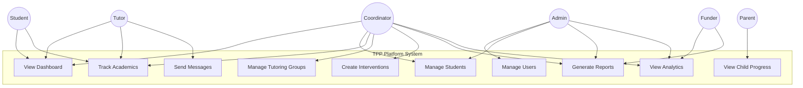

# Use Case Diagrams — TPP Platform

## System Use Case Overview

## Use Case Details

### UC-001: View Dashboard
- **Actors**: All authenticated users
- **Precondition**: User is signed in
- **Main Flow**: System displays role-appropriate dashboard with stats cards, recent activity, and quick actions
- **Extensions**: Dashboard content varies by role (student sees own performance, coordinator sees all students)

### UC-002: Manage Students
- **Actors**: Coordinator, Admin, Management
- **Precondition**: User has VIEW_ALL_STUDENTS permission
- **Main Flow**: View student list → Search/Filter → View details → Create/Edit/Archive student
- **Business Rules**: Only admin can archive; coordinator can create and edit

### UC-003: Track Academic Records
- **Actors**: Student (own), Tutor (assigned), Coordinator (all), Admin (all)
- **Precondition**: User has appropriate view permission
- **Main Flow**: Navigate to academics → View records → Filter by term/subject → View trends

### UC-004: Manage Tutoring Groups
- **Actors**: Coordinator, Admin
- **Precondition**: User has CREATE_TUTORING_GROUP permission
- **Main Flow**: Create group → Assign tutor → Add students → Set schedule → Activate
