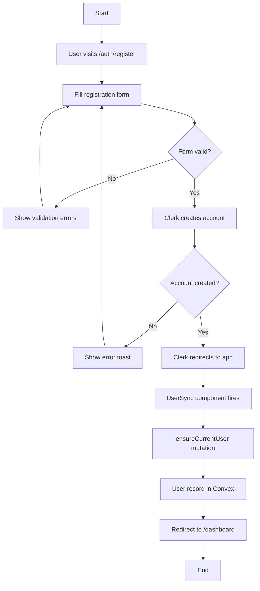
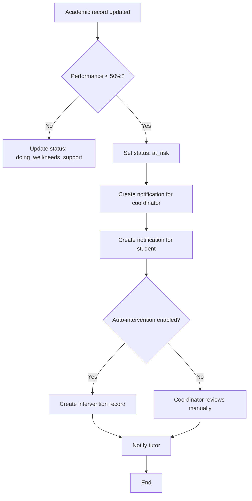
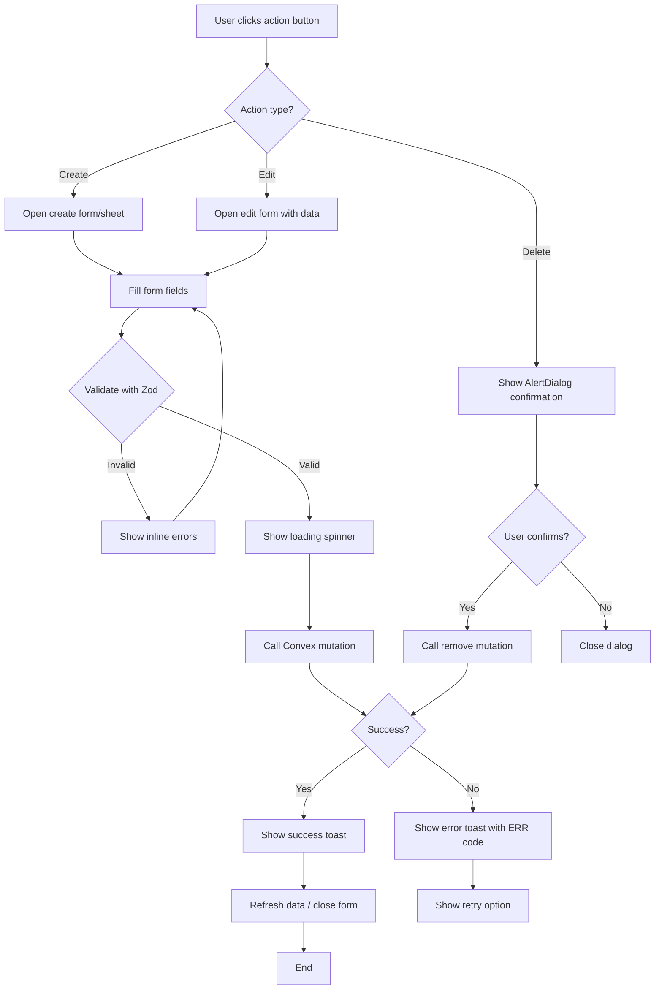

# Activity Diagrams — TPP Platform

## Student Registration Flow

```mermaid
flowchart TD
    A[Start] --> B[User visits /auth/register]
    B --> C[Fill registration form]
    C --> D{Form valid?}
    D -->|No| E[Show validation errors]
    E --> C
    D -->|Yes| F[Clerk creates account]
    F --> G{Account created?}
    G -->|No| H[Show error toast]
    H --> C
    G -->|Yes| I[Clerk redirects to app]
    I --> J[UserSync component fires]
    J --> K[ensureCurrentUser mutation]
    K --> L[User record in Convex]
    L --> M[Redirect to /dashboard]
    M --> N[End]
```

## At-Risk Student Alert Flow

```mermaid
flowchart TD
    A[Academic record updated] --> B{Performance < 50%?}
    B -->|No| C[Update status: doing_well/needs_support]
    B -->|Yes| D[Set status: at_risk]
    D --> E[Create notification for coordinator]
    E --> F[Create notification for student]
    F --> G{Auto-intervention enabled?}
    G -->|Yes| H[Create intervention record]
    G -->|No| I[Coordinator reviews manually]
    H --> J[Notify tutor]
    I --> J
    J --> K[End]
```

## CRUD Operation Flow (Generic)

```mermaid
flowchart TD
    A[User clicks action button] --> B{Action type?}
    B -->|Create| C[Open create form/sheet]
    B -->|Edit| D[Open edit form with data]
    B -->|Delete| E[Show AlertDialog confirmation]
    C --> F[Fill form fields]
    D --> F
    F --> G{Validate with Zod}
    G -->|Invalid| H[Show inline errors]
    H --> F
    G -->|Valid| I[Show loading spinner]
    I --> J[Call Convex mutation]
    J --> K{Success?}
    K -->|Yes| L[Show success toast]
    K -->|No| M[Show error toast with ERR code]
    E --> N{User confirms?}
    N -->|Yes| O[Call remove mutation]
    N -->|No| P[Close dialog]
    O --> K
    L --> Q[Refresh data / close form]
    M --> R[Show retry option]
    Q --> S[End]
```
