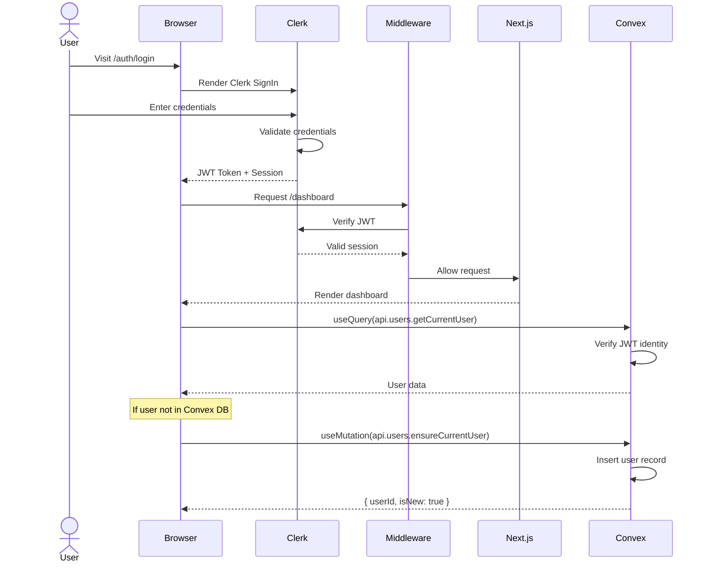
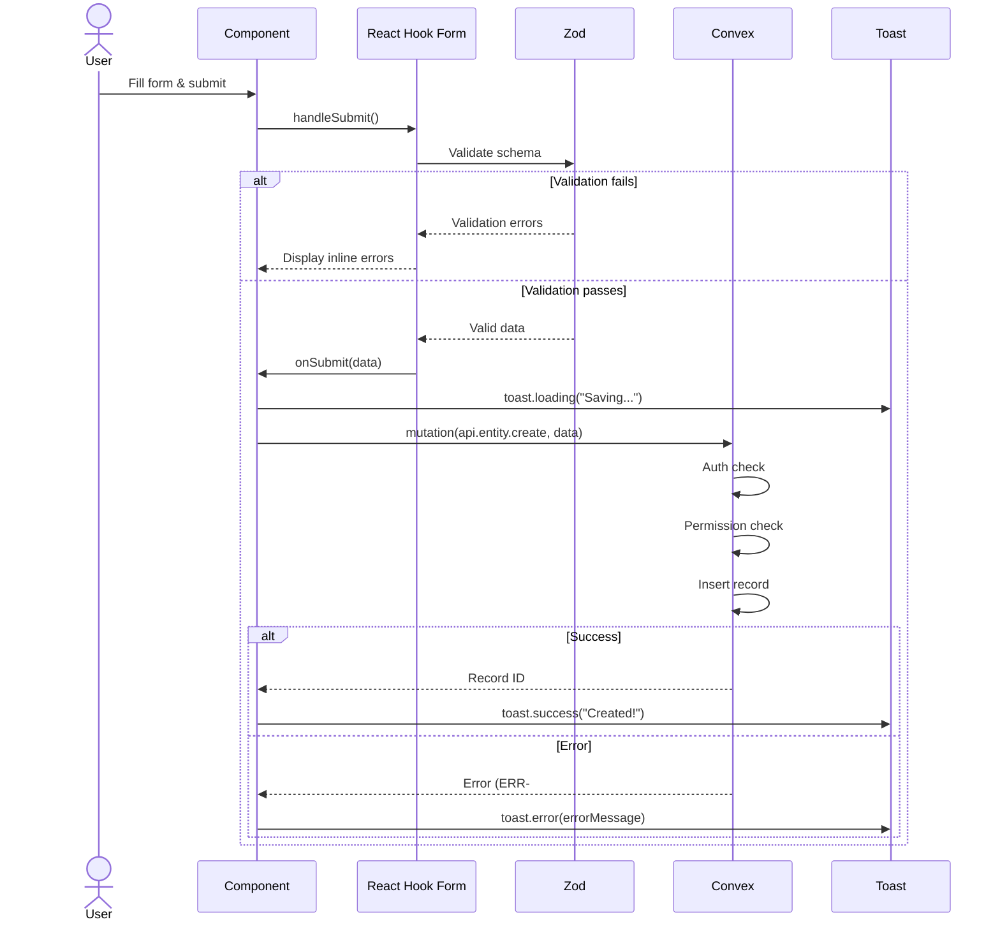
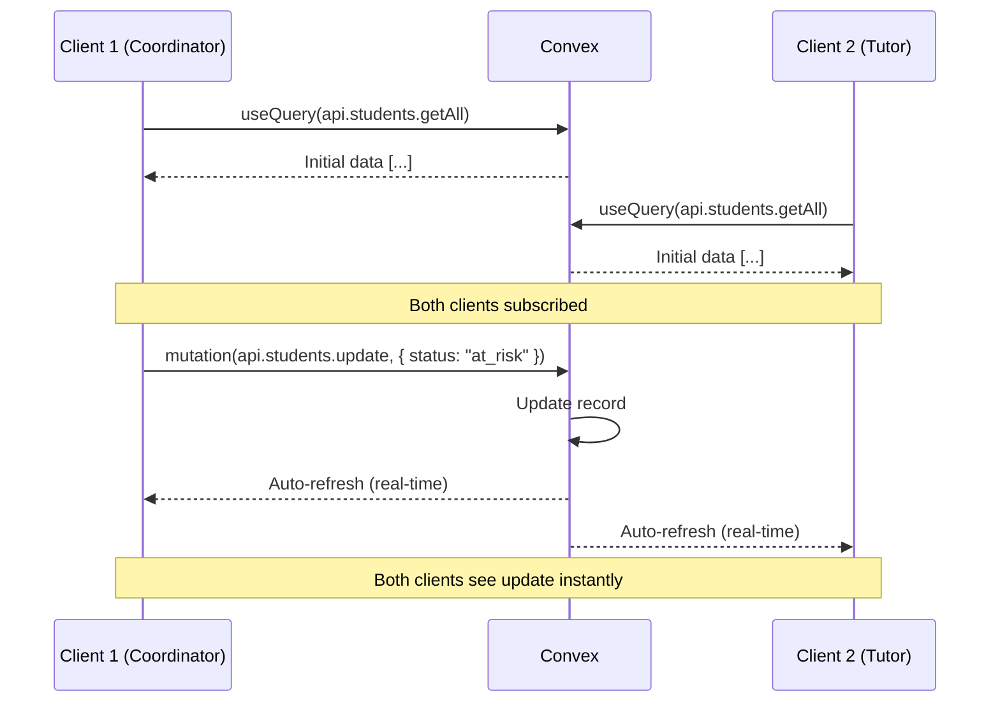

# Sequence Diagrams — TPP Platform

## Authentication Flow

```mermaid
sequenceDiagram
    actor U as User
    participant B as Browser
    participant CK as Clerk
    participant MW as Middleware
    participant NJ as Next.js
    participant CV as Convex

    U->>B: Visit /auth/login
    B->>CK: Render Clerk SignIn
    U->>CK: Enter credentials
    CK->>CK: Validate credentials
    CK-->>B: JWT Token + Session
    B->>MW: Request /dashboard
    MW->>CK: Verify JWT
    CK-->>MW: Valid session
    MW->>NJ: Allow request
    NJ-->>B: Render dashboard
    B->>CV: useQuery(api.users.getCurrentUser)
    CV->>CV: Verify JWT identity
    CV-->>B: User data
    Note over B: If user not in Convex DB
    B->>CV: useMutation(api.users.ensureCurrentUser)
    CV->>CV: Insert user record
    CV-->>B: { userId, isNew: true }
```

## Data Mutation Flow

```mermaid
sequenceDiagram
    actor U as User
    participant C as Component
    participant RHF as React Hook Form
    participant Z as Zod
    participant CV as Convex
    participant T as Toast

    U->>C: Fill form & submit
    C->>RHF: handleSubmit()
    RHF->>Z: Validate schema
    alt Validation fails
        Z-->>RHF: Validation errors
        RHF-->>C: Display inline errors
    else Validation passes
        Z-->>RHF: Valid data
        RHF->>C: onSubmit(data)
        C->>T: toast.loading("Saving...")
        C->>CV: mutation(api.entity.create, data)
        CV->>CV: Auth check
        CV->>CV: Permission check
        CV->>CV: Insert record
        alt Success
            CV-->>C: Record ID
            C->>T: toast.success("Created!")
        else Error
            CV-->>C: Error (ERR-###)
            C->>T: toast.error(errorMessage)
        end
    end
```

## Real-time Subscription Flow

```mermaid
sequenceDiagram
    participant C1 as Client 1 (Coordinator)
    participant CV as Convex
    participant C2 as Client 2 (Tutor)

    C1->>CV: useQuery(api.students.getAll)
    CV-->>C1: Initial data [...]
    C2->>CV: useQuery(api.students.getAll)
    CV-->>C2: Initial data [...]
    Note over C1,C2: Both clients subscribed
    C1->>CV: mutation(api.students.update, { status: "at_risk" })
    CV->>CV: Update record
    CV-->>C1: Auto-refresh (real-time)
    CV-->>C2: Auto-refresh (real-time)
    Note over C1,C2: Both clients see update instantly
```
