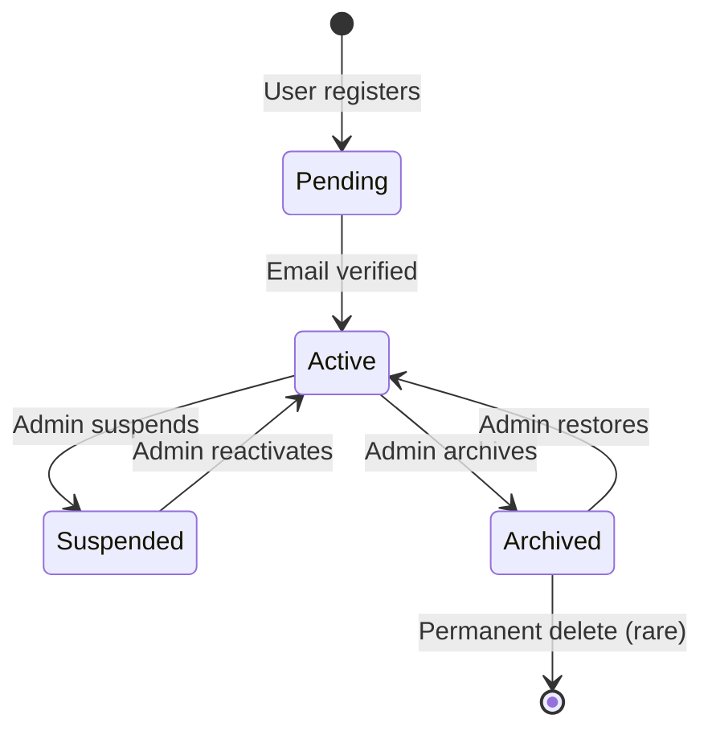
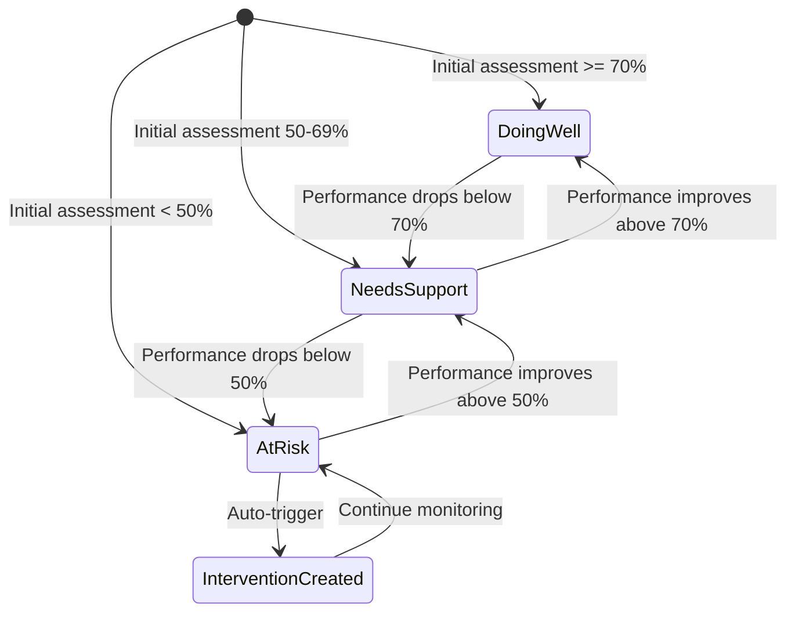
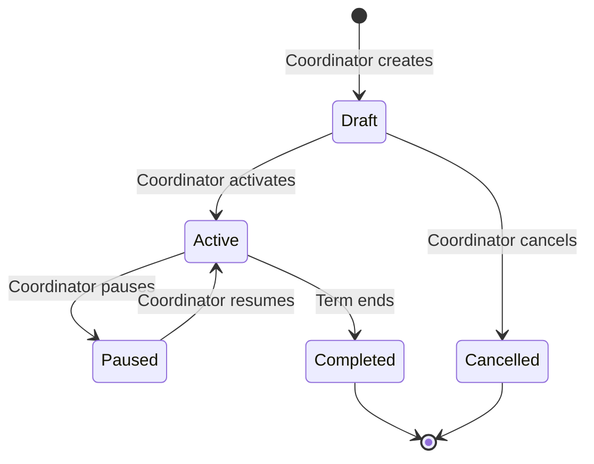
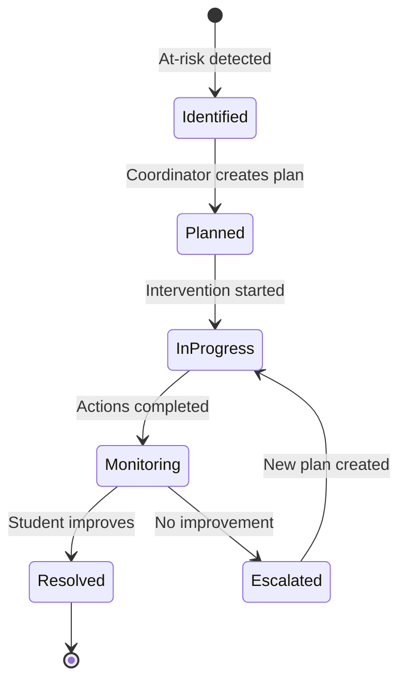

# State Diagrams — TPP Platform

## User Account States

```mermaid
stateDiagram-v2
    [*] --> Pending: User registers
    Pending --> Active: Email verified
    Active --> Suspended: Admin suspends
    Suspended --> Active: Admin reactivates
    Active --> Archived: Admin archives
    Archived --> Active: Admin restores
    Archived --> [*]: Permanent delete (rare)
```

## Student Performance States

```mermaid
stateDiagram-v2
    [*] --> DoingWell: Initial assessment >= 70%
    [*] --> NeedsSupport: Initial assessment 50-69%
    [*] --> AtRisk: Initial assessment < 50%

    DoingWell --> NeedsSupport: Performance drops below 70%
    NeedsSupport --> DoingWell: Performance improves above 70%
    NeedsSupport --> AtRisk: Performance drops below 50%
    AtRisk --> NeedsSupport: Performance improves above 50%

    AtRisk --> InterventionCreated: Auto-trigger
    InterventionCreated --> AtRisk: Continue monitoring
```

## Tutoring Group States

```mermaid
stateDiagram-v2
    [*] --> Draft: Coordinator creates
    Draft --> Active: Coordinator activates
    Active --> Paused: Coordinator pauses
    Paused --> Active: Coordinator resumes
    Active --> Completed: Term ends
    Completed --> [*]
    Draft --> Cancelled: Coordinator cancels
    Cancelled --> [*]
```

## Intervention States

```mermaid
stateDiagram-v2
    [*] --> Identified: At-risk detected
    Identified --> Planned: Coordinator creates plan
    Planned --> InProgress: Intervention started
    InProgress --> Monitoring: Actions completed
    Monitoring --> Resolved: Student improves
    Monitoring --> Escalated: No improvement
    Escalated --> InProgress: New plan created
    Resolved --> [*]
```
