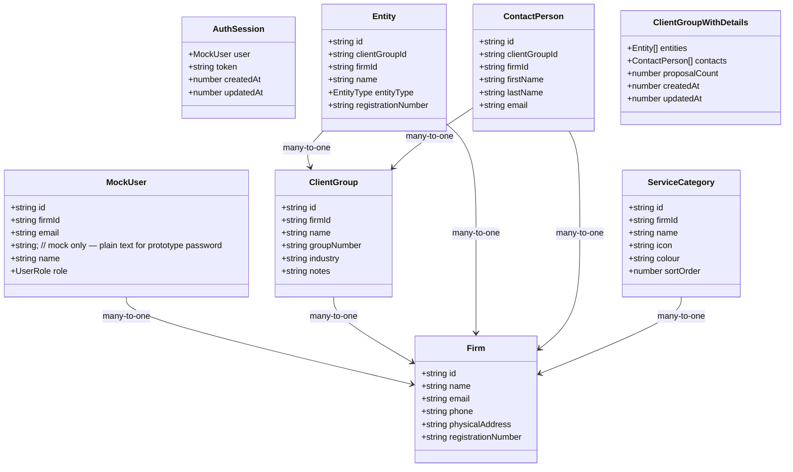
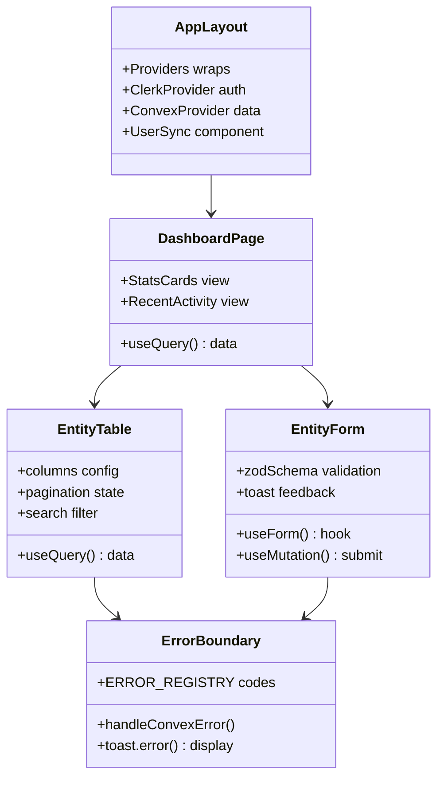

# Class Diagrams — TPP Platform

## Entity Class Diagram

```mermaid
classDiagram
    class MockUser {
        +string id
        +string firmId
        +string email
        +string; // mock only — plain text for prototype password
        +string name
        +UserRole role
    }
    class AuthSession {
        +MockUser user
        +string token
        +number createdAt
        +number updatedAt
    }
    class Firm {
        +string id
        +string name
        +string email
        +string phone
        +string physicalAddress
        +string registrationNumber
    }
    class ClientGroup {
        +string id
        +string firmId
        +string name
        +string groupNumber
        +string industry
        +string notes
    }
    class Entity {
        +string id
        +string clientGroupId
        +string firmId
        +string name
        +EntityType entityType
        +string registrationNumber
    }
    class ContactPerson {
        +string id
        +string clientGroupId
        +string firmId
        +string firstName
        +string lastName
        +string email
    }
    class ClientGroupWithDetails {
        +Entity[] entities
        +ContactPerson[] contacts
        +number proposalCount
        +number createdAt
        +number updatedAt
    }
    class ServiceCategory {
        +string id
        +string firmId
        +string name
        +string icon
        +string colour
        +number sortOrder
    }

    MockUser --> Firm : many-to-one
    ClientGroup --> Firm : many-to-one
    Entity --> ClientGroup : many-to-one
    Entity --> Firm : many-to-one
    ContactPerson --> ClientGroup : many-to-one
    ContactPerson --> Firm : many-to-one
    ServiceCategory --> Firm : many-to-one
```

## Component Architecture

```mermaid
classDiagram
    class AppLayout {
        +Providers wraps
        +ClerkProvider auth
        +ConvexProvider data
        +UserSync component
    }
    class DashboardPage {
        +useQuery() data
        +StatsCards view
        +RecentActivity view
    }
    class EntityTable {
        +useQuery() data
        +columns config
        +pagination state
        +search filter
    }
    class EntityForm {
        +useForm() hook
        +zodSchema validation
        +useMutation() submit
        +toast feedback
    }
    class ErrorBoundary {
        +handleConvexError()
        +ERROR_REGISTRY codes
        +toast.error() display
    }

    AppLayout --> DashboardPage
    DashboardPage --> EntityTable
    DashboardPage --> EntityForm
    EntityTable --> ErrorBoundary
    EntityForm --> ErrorBoundary
```
