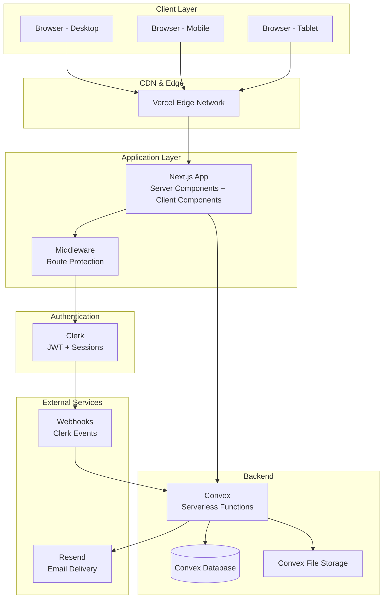

# Network Diagram — TPP Platform

## Infrastructure Topology

## Network Security

| Layer | Protection |
|-------|-----------|
| Client → CDN | HTTPS (TLS 1.3) |
| CDN → App | Vercel internal network |
| App → Clerk | HTTPS + API keys |
| App → Convex | HTTPS + JWT tokens |
| Convex → DB | Internal (encrypted at rest) |

## DNS & Domains
- **Production**: tpp-platform.vercel.app (or custom domain)
- **Staging**: tpp-platform-git-*.vercel.app
- **Convex**: *.convex.cloud (managed)
- **Clerk**: *.clerk.accounts.dev (managed)
