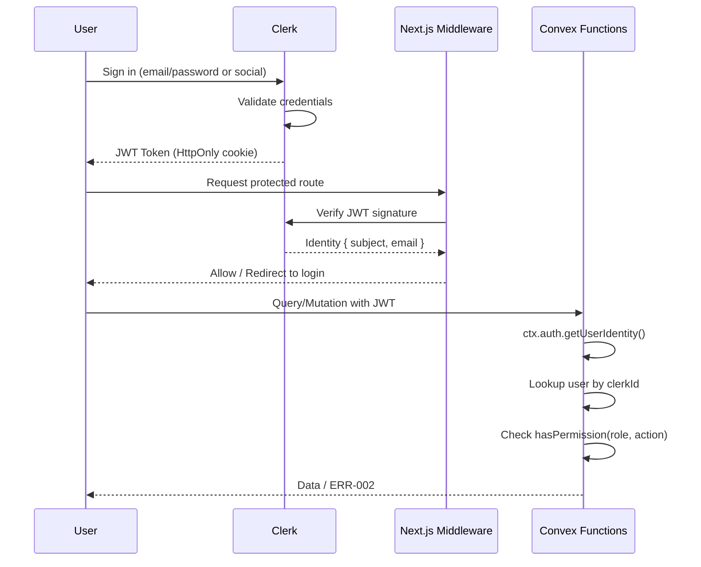

# Security Architecture — TPP Platform

## Authentication Flow

## Security Layers

| Layer | Control | Implementation |
|-------|---------|---------------|
| Network | HTTPS/TLS | Vercel (automatic) |
| CDN | DDoS protection | Vercel Edge |
| Application | CSP headers | next.config.ts headers() |
| Route | Auth middleware | Clerk middleware.ts |
| API | JWT verification | Convex auth identity |
| Data | RBAC permissions | convex/auth/permissions.ts |
| Input | Validation | Zod schemas on all mutations |
| Output | Encoding | React auto-escapes JSX |
| Storage | Encryption at rest | Convex (managed) |
| Secrets | Env vars only | .env.local (never committed) |

## OWASP Top 10 Mitigation

| Risk | Mitigation | Status |
|------|-----------|--------|
| A01: Broken Access Control | RBAC + middleware + Convex auth checks | Implemented |
| A02: Cryptographic Failures | HTTPS, Clerk handles passwords | Implemented |
| A03: Injection | Convex parameterized queries (no raw SQL) | By design |
| A04: Insecure Design | .Cursor framework enforces secure patterns | Active |
| A05: Security Misconfiguration | Security headers in next.config.ts | Implemented |
| A06: Vulnerable Components | npm audit, dependabot | Configured |
| A07: Auth Failures | Clerk handles auth (rate limiting, lockout) | Delegated |
| A08: Data Integrity | Convex ACID transactions | By design |
| A09: Security Logging | Audit trail on all mutations | Implemented |
| A10: SSRF | No user-controlled URLs in server functions | By design |
