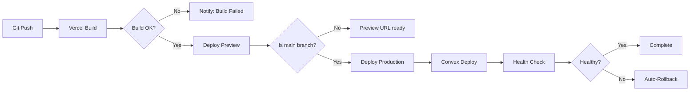

# Deployment Implementation — TPP Platform

## Deployment Pipeline



## Environment Setup

### Vercel
```bash
# Install Vercel CLI
npm i -g vercel

# Link project
vercel link

# Set environment variables
vercel env add NEXT_PUBLIC_CLERK_PUBLISHABLE_KEY
vercel env add CLERK_SECRET_KEY
vercel env add NEXT_PUBLIC_CONVEX_URL
```

### Convex
```bash
# Development
npx convex dev

# Production deploy
npx convex deploy

# Set Convex env vars
npx convex env set RESEND_API_KEY re_xxx
npx convex env set CLERK_WEBHOOK_SECRET whsec_xxx
```

## Production Checklist
- [ ] All env vars set in Vercel
- [ ] All env vars set in Convex
- [ ] Clerk production instance configured
- [ ] Custom domain configured
- [ ] SSL certificate active
- [ ] Security headers verified
- [ ] Error tracking configured
- [ ] Backup strategy confirmed
